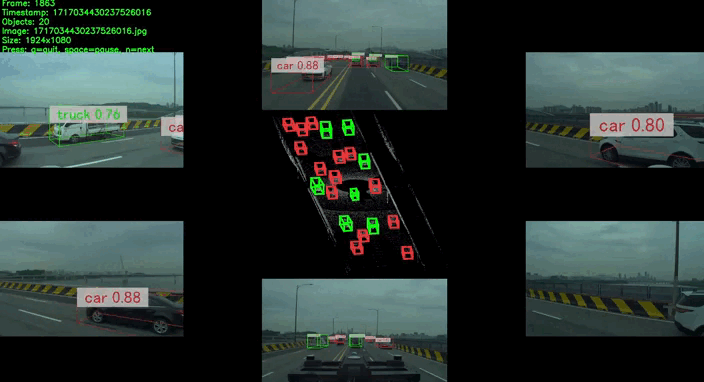
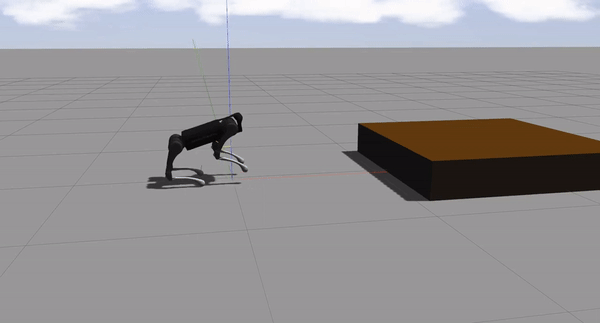



## Research Interests

I am interested in many different aspects of Computer Vision and Robotics:

- 2D/3D Object Detection
- 2D/3D Object Tracking
- Point Cloud Reconstruction
- 2D/3D Panoptic Segmentation
- 2D/3D Semantic/Instance Segmentation 

## Production Projects

### ADAS 3D Object Detection
1. An end-to-end 3D Object Detector using lidar only run on a HPC, display realtime with predicted bbox and raw sequence point cloud, can run with 12+ FPS and AP> 85 for Car, Truck, etc classes.
- Multi-threaded Architecture: Independent data loading, inference, post-processing, and visualization threads.
- Real-time Visualization: build toolbox of 3D point cloud rendering with Open3D.
- FPS tracking and bottleneck analysis.
- Flexible Display: Support for point clouds, voxels, and bounding box visualization

2. An end-to-end 3D Object Detector and SORT tracking method using lidar-camera (6-8 cams), run on a Jetson edge-device, display realtime support bbox mode or 3D model mode base on leightweight Godot front end.
- Multi-threaded Architecture: Independent data loading, inference, post-processing, and visualization threads.
- Real-time Visualization: build toolbox of 3D point cloud rendering with Open3D.
- FPS tracking and bottleneck analysis.
- Flexible Display: Support for point clouds, voxels, and bounding box visualization

 

## Academia Research Project

### 3D Object Detection based on Spatial Shape Transformer
A high-performance 3D Object detection framwork using point cloud based on Transformer achitecture. This framework provides a comprehensive understanding of an object’s dimensions, rotations, and spatial relationships with its surroundings. Please refer to our publication
\[[paper](https://ieeexplore.ieee.org/abstract/document/10399338/){:target="blank"}\]

### 3D Detector for Occluded Object under Obstructed Conditions
We propose a deep learning framework for reconstructing the occluded object. With the encoder-decoder methodology, our model ability to perceive and understand 3-D space under obstructed conditions. Leveraging the advantages of the point-voxel-based method, the model generates the high-quality 3D bounding box while preserving detailed object shape context. Please refer to our publication
\[[paper](https://ieeexplore.ieee.org/abstract/document/10399338/){:target="blank"}\]

### Improving Object Shape of 3D Detector
We propose a method for enhancing object shape for 3D detector. Please refer to our publication
\[[paper](https://icoin.org/media?key=site/icoin2024/abs/P-3-2.pdf){:target="blank"}\]

### Jumping optimization for quadruped robot.
We propose a method for optimizing the jump trajectory of quadruped robot using spatial v2. Please refer to our source
\[[matlab source](https://github.com/hiepbk/Quadruped_Robot_A1_Matlab){:target="blank"}\] | \[[ros source](https://github.com/hiepbk/Quadruped_Robot_A1_ROS_Gazebo){:target="blank"}\]

 

