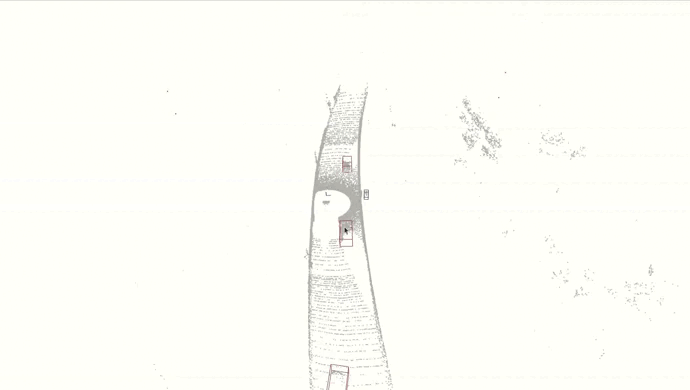
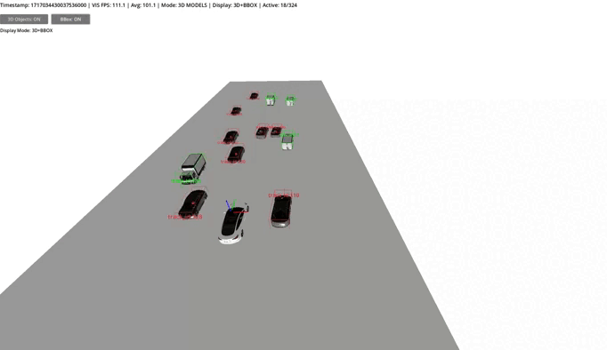
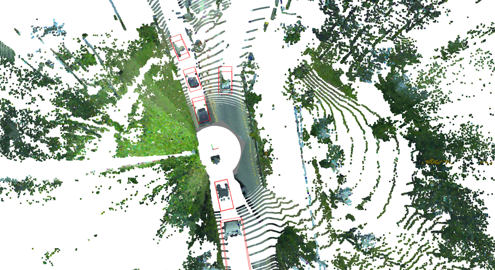
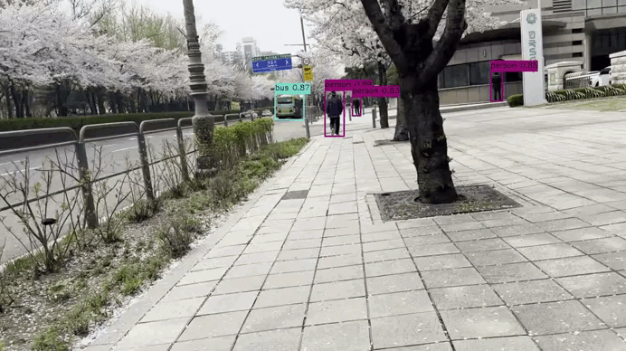
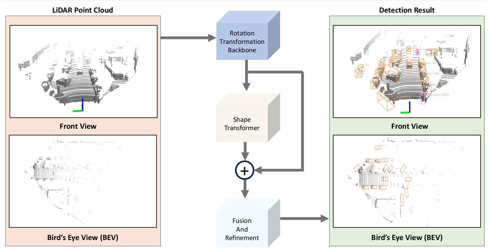
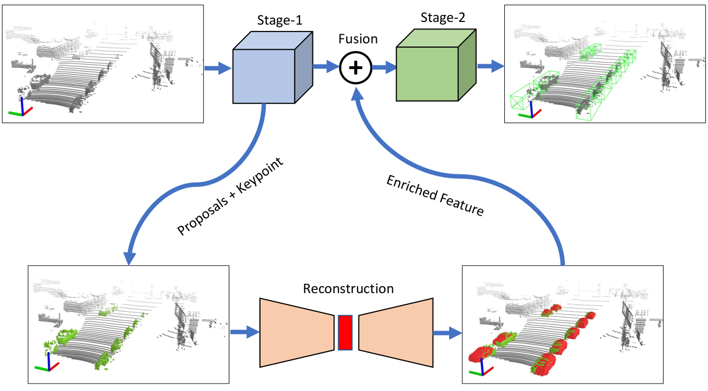
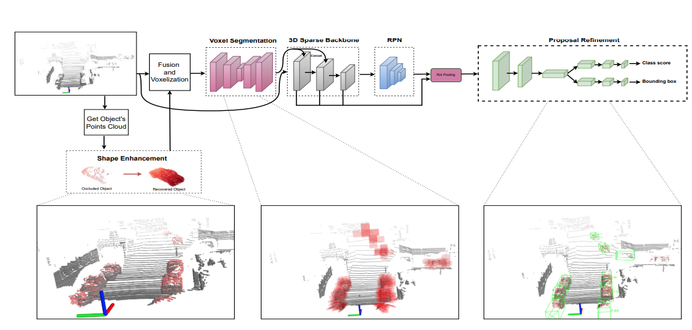
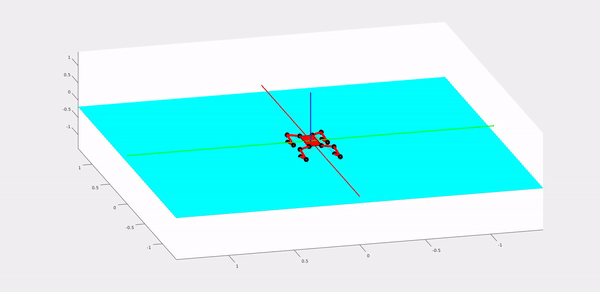



## Research Interests

I am passionate about various aspects of Computer Vision and Robotics, including:

- <i class="fa fa-cube"></i> **2D/3D Object Detection & Tracking**
- <i class="fa fa-th"></i> **Panoptic & Semantic Segmentation**
- <i class="fa fa-cloud"></i> **Point Cloud Reconstruction**

---

## Production Projects

  <!-- Project 1: 3D Object Detection -->
  

    
    

      <h3><i class="fa fa-car icon"></i>[ADAS] 3D Object Detection</h3>
      

        <strong>Key Features:</strong> 
        • End-to-end LiDAR-based detector 
        • Real-time visualization with predicted bounding boxes 
        • Multi-threaded pipeline for data loading, inference, and display
      

    

  

  <!-- Project 2: 3D Object Detection & SORT Tracking -->
  

    
    

      <h3><i class="fa fa-car icon"></i>[ADAS] 3D Object Detection & Tracking</h3>
      

        <strong>Key Features:</strong> 
        • Fusion of LiDAR and camera data 
        • High-performance detection on edge devices 
        • Real-time SORT tracking with remote monitoring via websockets
      

    

  

  <!-- Project 3: 3D Point Cloud Scene Reconstruction -->
  

    
    

      <h3><i class="fa fa-car icon"></i>[ADAS] 3D Point Cloud Scene Reconstruction</h3>
      

        <strong>Key Features:</strong> 
        • Unified interface for multi-dataset support (NuScenes, DDAD, KITTI) 
        • Self-supervised learning without ground truth depth 
        • Integrated 3D visualization with CamViz
      

    

  

  <!-- Project 4: 2D Panoptic / Semantic / Instance Segmentation -->
  

    
    

      <h3><i class="fa fa-car icon"></i>[ADAS] 2D Panoptic Segmentation</h3>
      

        <strong>Key Features:</strong> 
        • Real-time inference on PC and edge devices 
        • Multi-threaded architecture with teacher-student distillation 
        • Prototype web app built with Gradio
      

    

  

  <!-- Project 5: 2D Object Detection -->
  

    
    

      <h3><i class="fa fa-car icon"></i>[ADAS] 2D Object Detection</h3>
      

        <strong>Key Features:</strong> 
        • Fast, lightweight model on Jetson edge devices 
        • Real-time display with minimal latency 
        • Optimized for web prototyping with Gradio
      

    

  

## Academia Research Projects

  <!-- Academic Project 1 -->
  

    
    

      <h3><i class="fa fa-graduation-cap icon"></i>3D Object Detection with Spatial Shape Transformer</h3>
      

        A high-performance 3D detector using Transformer architecture, offering a deep understanding of object dimensions and spatial relationships.
         <a href="https://ieeexplore.ieee.org/abstract/document/10399338/" target="_blank">[Paper]</a>
      

    

  

  <!-- Academic Project 2 -->
  

    
    

      <h3><i class="fa fa-graduation-cap icon"></i>3D Detector for Occluded Object</h3>
      

        Utilizing a point-voxel based method, the framework produces high-quality 3D bounding boxes while preserving shape context.
         <a href="https://ieeexplore.ieee.org/abstract/document/10399338/" target="_blank">[Paper]</a>
      

    

  

  <!-- Academic Project 3 -->
  

    
    

      <h3><i class="fa fa-graduation-cap icon"></i>Improving Object Shape of 3D Detector</h3>
      

        Enhancing object shape accuracy with innovative techniques and a lightweight quantized model.
         <a href="https://icoin.org/media?key=site/icoin2024/abs/P-3-2.pdf" target="_blank">[Paper]</a>
      

    

  

  <!-- Academic Project 4 -->
  

    
    

      <h3><i class="fa fa-graduation-cap icon"></i>Jumping Optimization for Quadruped Robot</h3>
      

        Optimizing jump trajectories using spatial methods on both Matlab and ROS platforms for agile robotics.
         <a href="https://github.com/hiepbk/Quadruped_Robot_A1_Matlab" target="_blank">[Matlab Source]</a> |
        <a href="https://github.com/hiepbk/Quadruped_Robot_A1_ROS_Gazebo" target="_blank">[ROS Source]</a>
      

    

  

