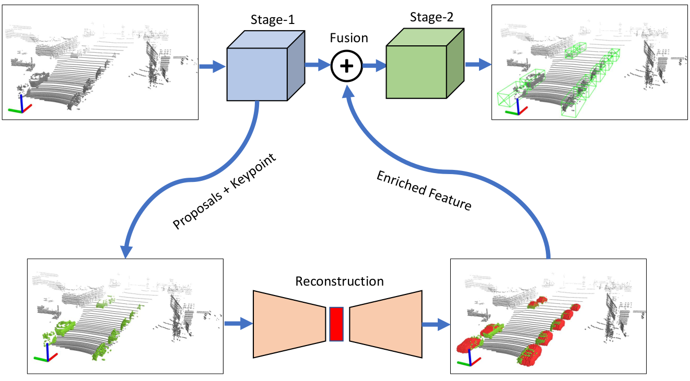



## Research Interests

I am interested in many different aspects of Computer Vision:

- Large-scale representation learning of 3D Point Cloud.
- 3D Object Detection and Tracking of Point Cloud.
- Simultaneous Localization and Mapping (SLAM) and Depth Estimation.
- Quadruped Robot Optimization.

## On-going Projects

### 3D Depth Estimation.
### Simultaneous Localization and Mapping (SLAM).

## Previous Projects

### 3D Object Detection based on Spatial Shape Transformer
A high-performance 3D Object detection framwork using point cloud based on Transformer achitecture. This framework provides a comprehensive understanding of an object’s dimensions, rotations, and spatial relationships with its surroundings. Please refer to our publication
\[[paper](https://ieeexplore.ieee.org/abstract/document/10399338/){:target="blank"}\]

### 3D Detector for Occluded Object under Obstructed Conditions
We propose a deep learning framework for reconstructing the occluded object. With the encoder-decoder methodology, our model ability to perceive and understand 3-D space under obstructed conditions. Leveraging the advantages of the point-voxel-based method, the model generates the high-quality 3D bounding box while preserving detailed object shape context. Please refer to our publication
\[[paper](https://ieeexplore.ieee.org/abstract/document/10399338/){:target="blank"}\]

### Improving Object Shape of 3D Detector
We propose a method for enhancing object shape for 3D detector. Please refer to our publication
\[[paper](https://icoin.org/media?key=site/icoin2024/abs/P-3-2.pdf){:target="blank"}\]

### Jumping optimization for quadruped robot.
We propose a method for optimizing the jump trajectory of quadruped robot using spatial v2. Please refer to our source
\[[matlab source](https://github.com/hiepbk/Quadruped_Robot_A1_Matlab){:target="blank"}\]

\[[ros source](https://github.com/hiepbk/Quadruped_Robot_A1_ROS_Gazebo){:target="blank"}\]

 

